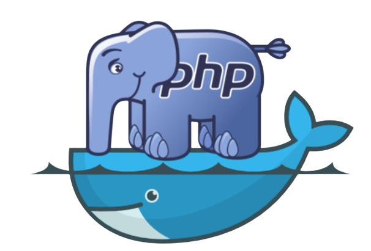

# Projeto PHP/Postegrs - Formulário Cadastral 
### Esse projeto foi realizado durante a finalização do terceiro módulo do programa de capacitação DevOps da B3 em parceria com a Ada Tech. Antes de explicar como desenrolou a execusão, cabe destacar os tópicos solicitados.
[Capacitação DevOps](https://ada.tech/sou-aluno/programas/b3-deva) </br>

## Requisitos
- Duas imagens próprias:
    - Aplicação sem restrições ao uso da linguagem;
    - Banco de dados;
- Comunicação entre os dois containers;
- Volume named atrelado ao banco de dados;
- Construção feita usando Docker Compose;
- É necessário que tenha documentação do uso das imagens no Docker Hub e da aplicação no GitHub.

## O Projeto 
### Formulário Cadastral


Mediante ao desenvolvimento de uma aplicação web em PHP implementei um processo simplificado para levantamento de dados cadastrais, através do Docker virtualizei o banco de dados e a aplicação, por meio do Docker Compose gerenciei de forma centralizada os contêineres. Para o processamento de fluxo de dados utilizei PostgreSQL, viabilizando uma maior organização e praticidade.

> [!WARNING]
> É necessário possuir o Docker e o Docker Compose em sua máquina. Caso aindo não tenha instalado, acesse a documentação do [Docker](https://docs.docker.com/) e do [Docker Compose](https://docs.docker.com/compose/instally).

## Execução

1. Copiar o repositório
```
git clone https://github.com/BiancaMalta/Docker.git
```
> [!CAUTION]
> Este repositório contém uma grande variedade de arquivos. Tenha em mente que os passos a seguir devem ser executados dentro dessa pasta.
2. Configurar as variáveis de ambiente
###### O Docker Compose utiliza algumas variáveis de ambiente para configurar os serviços de aplicação e banco de dados. Usar a configuração fornecida não é o ideal no quesito segurança, recomendo personalizá-la. Com esse propósito, abra o terminal na pasta `config` e navegue pelos arquivos `db.env`, o qual possui as variáveis do banco de dados, e `php.env`, responsável pelos ajustes na aplicação.
3. No diretório raiz execute o `docker-compose.yml`
```
docker-compose up
```
###### Para executar em segundo plano, basta colocar a flag `-d` e na hipótese de que, após esse processo, você efetue alguma alteração nas imagens, ao rodar novamente, use a flag `--build`

4. Após inicializar, você poderá acessar a aplicação navegando para `http://localhost:5000` no seu navegador.

5. Para encerrar o projeto, execute:
```
docker-compose down
```

## Documentação Adicional

Como solicitado, as imagens do [projeto PHP]() e do [banco PostgreeSQL]() estão disponibilizadas e documentadas no meu [Docker Hub]().

## Referências

[Instrutora - Thayse Frankenberger](https://www.linkedin.com/in/thayse-frankenberger-9832161b7/?originalSubdomain=br)

## Autora
[](https://www.linkedin.com/in/bianca-malta/)
